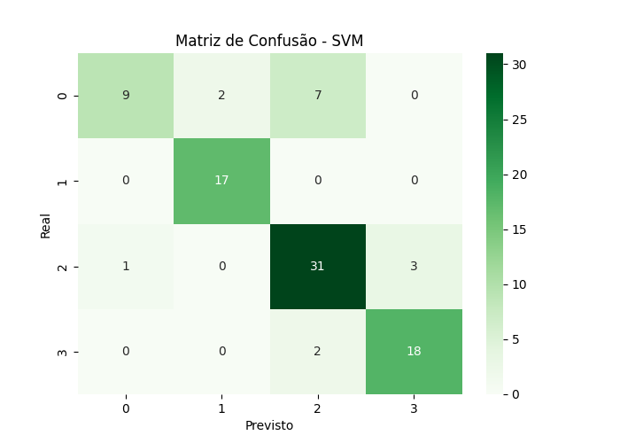
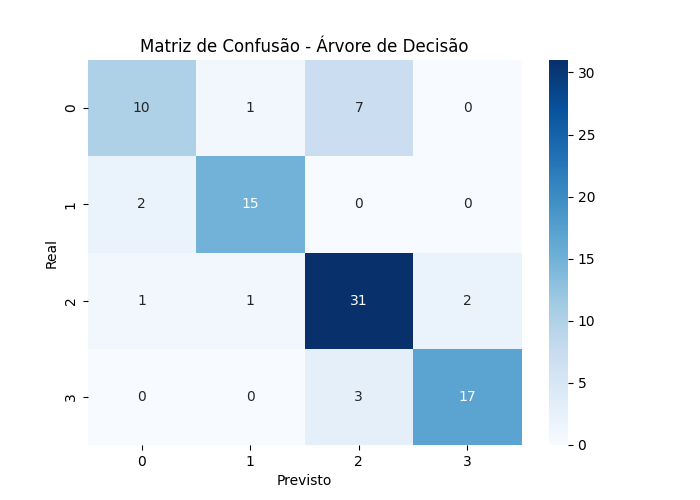
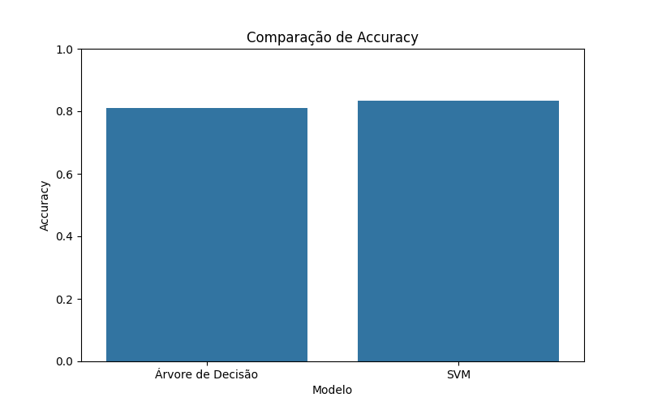
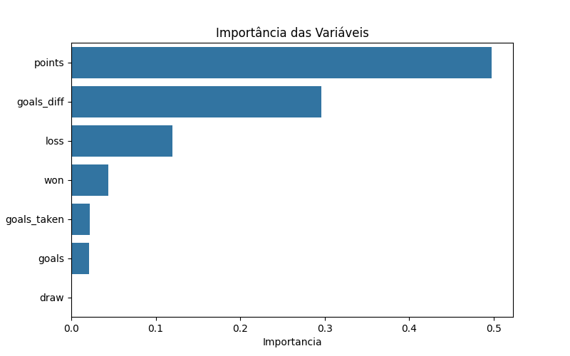

# Disciplina de Inteligência Artificial , Professor Munif , Unicesumar 2026

Ánalise de DataSet sobre Brasileirão 2003-2024 para classificar as equipes e comparar dois modelos distintos de Inteligência Artificial.

## Alunos
- Gabriel Felipe Alexandre dos Santos - RA: 25362250-2
- Pedro Paulo Barbosa Arantes - RA: 25362249-2
- Lucas de Freitas Bovo - RA: 25362304-2

### Modelos Treinados
Após a execução do projeto são gerados os seguintes arquivos:

- modelo_arvore.pkl
- modelo_svm.pkl
- scaler.pkl

Esses arquivos permitem reutilizar os modelos treinados sem a necessidade de realizar novamente o treinamento.

## Análise de Desempenho das Equipes no Brasileirão e Classificação em Categorias de Desempenho (2003-2024)

Utilizamos estatísticas da temporada (pontos, vitórias, derrotas, gols marcados e saldo de gols) e a partir dessas métricas, os modelos aprenderam padrões históricos para classificar cada equipe em uma das quatro categorias definidas: Elite, Competitivo, Intermediário ou Rebaixado. E após a classificação comparamos o desempenho da Árvore de Decisão e do SVM utilizando Accuracy, F1-Score e Matriz de Confusão.

A hipótese deste trabalho é que as estatísticas de desempenho de uma equipe durante uma temporada do Campeonato Brasileiro, como pontos conquistados, vitórias, derrotas e saldo de gols, são suficientes para identificar padrões capazes de classificar corretamente as equipes em categorias de desempenho. Além disso, espera-se que o modelo SVM apresente desempenho superior ao da Árvore de Decisão devido à sua maior capacidade de generalização em problemas de classificação.

O dataset apresenta registros históricos oficiais do Campeonato Brasileiro Série A (Brasileirão), cobrindo todas as temporadas desde a adoção do sistema de pontos corridos em 2003 até 2024. Ele apresenta diversas informações sobre as equipes participantes do campeonato trazendo contexto de gols, pontos, partidas jogadas, colocação, dentre outros. 

Sabendo dessas informações, utilizamos o método da Árvore de Decisão e a SVM para classificar e, posteriormente, comparar os resultados. A Árvore de Decisão foi utilizada como método da Parte 1. O algoritmo cria regras de decisão a partir dos dados de treinamento, permitindo classificar as equipes nas categorias definidas. O SVM foi utilizado como método da Parte 2. O algoritmo busca encontrar fronteiras de decisão que separem da melhor forma possível as diferentes categorias de desempenho das equipes.

### Avaliação dos Modelos e Comparação dos Modelos
Os modelos foram avaliados utilizando Accuracy, F1-Score, Classification Report e Matrizes de Confusão.





As matrizes de confusão nos informam que os dois modelos foram bem em suas classificações, porém o SVM teve um desempenho um pouco superior a Árvore de Decisão.




É possível perceber que a diferença no rendimento da Árvore para o SVM foi de 2,22% e a diferença no rendimento no F1-Score foi de 1,69%

Os resultados demonstraram que as estatísticas de desempenho das equipes possuem forte relação com sua classificação final no campeonato. Tanto a Árvore de Decisão quanto o SVM conseguiram identificar padrões relevantes nos dados históricos do Brasileirão.

Como dito, o modelo SVM apresentou o melhor desempenho, alcançando Accuracy de 83,33% e F1-Score de 82,36%, superando a Árvore de Decisão nas duas métricas avaliadas. Isso indica que o SVM foi mais eficiente na generalização dos padrões presentes no conjunto de dados.

A análise também mostrou que os atributos mais importantes para a classificação das equipes foram a quantidade de pontos conquistados, o saldo de gols e o número de derrotas, fatores diretamente relacionados ao desempenho esportivo dos clubes.



Com isso, concluimos que técnicas de Inteligência Artificial podem ser utilizadas para classificar equipes em categorias de desempenho a partir de estatísticas históricas do Campeonato Brasileiro.

## Dataset

Utilizamos um dataset público disponibilizado na plataforma Kaggle, o link de acesso é:
https://www.kaggle.com/datasets/lucasyukioimafuko/brasileirao-serie-a-2006-2022?select=brasileirao.csv

Ele contém registros históricos oficiais do Campeonato Brasileiro Série A (Brasileirão), cobrindo todas as temporadas desde a adoção do sistema de pontos corridos em 2003 até 2024. Ele reúne informações consolidadas de desempenho de todos os clubes que participaram do campeonato ao longo desses 22 anos.

O arquivo utilizado para os modelos foi o "brasileirao.csv". Ele possui aproximadamente 460 registros. Cada linha traz informações sobre o desempenho de um time em uma determinada temporada, o que nos permite analisar a evolução histórica dos clubes ao longo de mais de duas décadas.

Esse dataset é bem organizado e contém as seguintes colunas:
- season: Ano da temporada 
- team: Nome do clube 
- place: Posição final no campeonato (de 1 a 20) 
- points: Total de pontos conquistados 
- won: Número de vitórias 
- draw: Número de empates 
- loss: Número de derrotas 
- goals: Gols marcados 
- goals_taken: Gols sofridos 
- goals_diff: Saldo de gols

A variável alvo utilizada foi a "categoria", que foi criada a partir da posição final dos clubes da coluna "place". O objetivo foi transformar a classificação final em categorias de desempenho. As categorias foram definidas da seguinte forma:
- Elite → Posições 1 a 4 
- Competitivo → Posições 5 a 8 
- Intermediário → Posições 9 a 16 
- Rebaixado → Posições 17 a 20 

Os modelos receberam como entrada estatísticas da temporada, como pontos, vitórias, derrotas, gols marcados, gols sofridos e saldo de gols, e tiveram como objetivo prever em qual categoria de desempenho cada equipe se enquadra.

O dataset foi carregado utilizando a lib Pandas e foram realizadas verificações da estrutura dos dados, incluindo quantidade de registros, colunas disponíveis e distribuição das classes. A partir disso, foi criada a variável alvo "categoria", baseada na posição final dos clubes (place), agrupando as equipes em quatro categorias de desempenho: Elite, Competitivo, Intermediário e Rebaixado.

Para o treinamento dos modelos, foram selecionados os atributos numéricos mais relevantes da temporada: points, won, draw, loss, goals, goals_taken e goals_diff. Esses atributos foram utilizados como variáveis de entrada dos algoritmos.

Sabendo que o modelo SVM é sensível à escala dos dados, foi aplicada uma técnica de padronização utilizando o StandardScaler, garantindo que todas as variáveis possuíssem média igual a zero e desvio padrão igual a um antes do treinamento.

O conjunto de dados foi dividido em 80% para treinamento e 20% para teste, utilizando a função train_test_split da biblioteca Scikit-Learn.

Além disso, foi utilizada a estratégia de amostragem estratificada (stratify=y), garantindo que a proporção das categorias de desempenho fosse mantida tanto no conjunto de treinamento quanto no conjunto de teste. Essa abordagem permite uma avaliação mais confiável dos modelos, reduzindo possíveis distorções causadas por diferenças na distribuição das classes.

Ao final da divisão, aproximadamente 360 registros foram utilizados para treinamento dos modelos e 90 registros para avaliação de desempenho.

# Como Executar o Projeto

Clone o repositório

```bash
  git clone https://github.com/gabrsantos1/ai-model-comparative.git
```

Entre na pasta do projeto

```bash
  cd ai-model-comparative
  cd munif
```

Instale as dependências

```bash
  pip install -r requirements.txt
```

Execute o projeto

```bash
  python dataset.py
```
